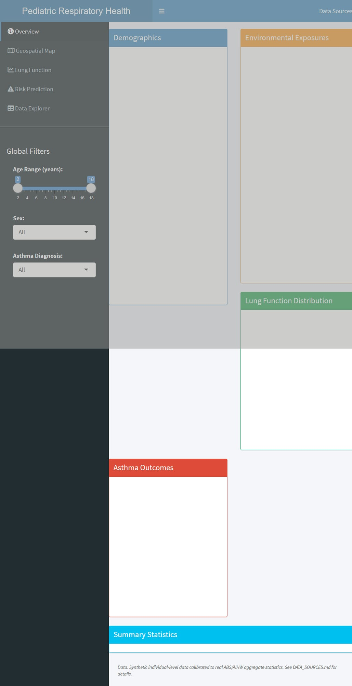
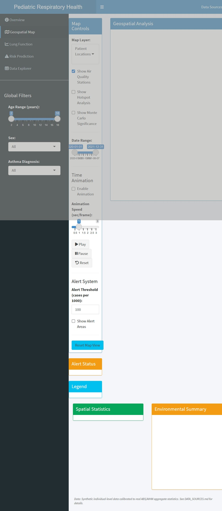
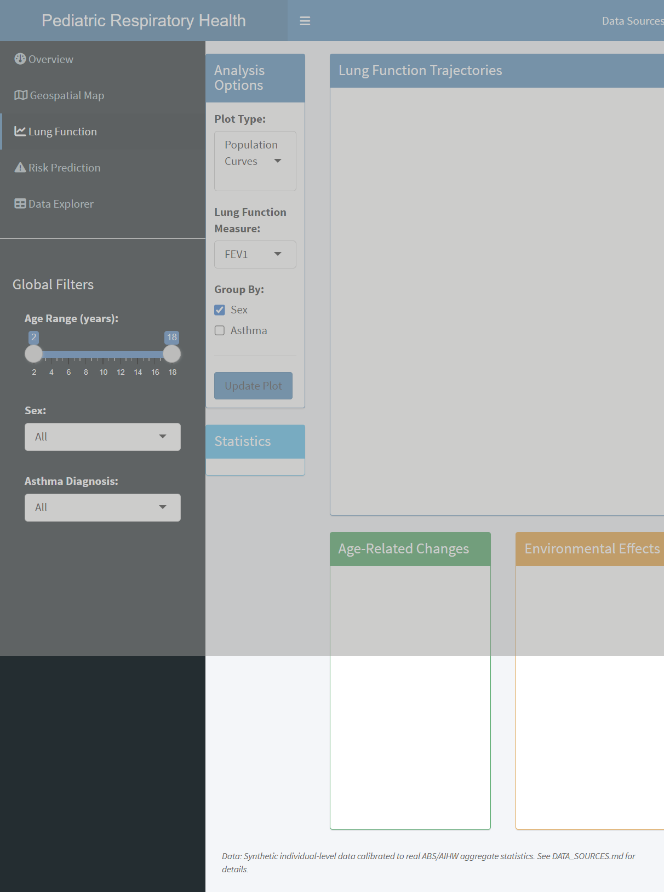
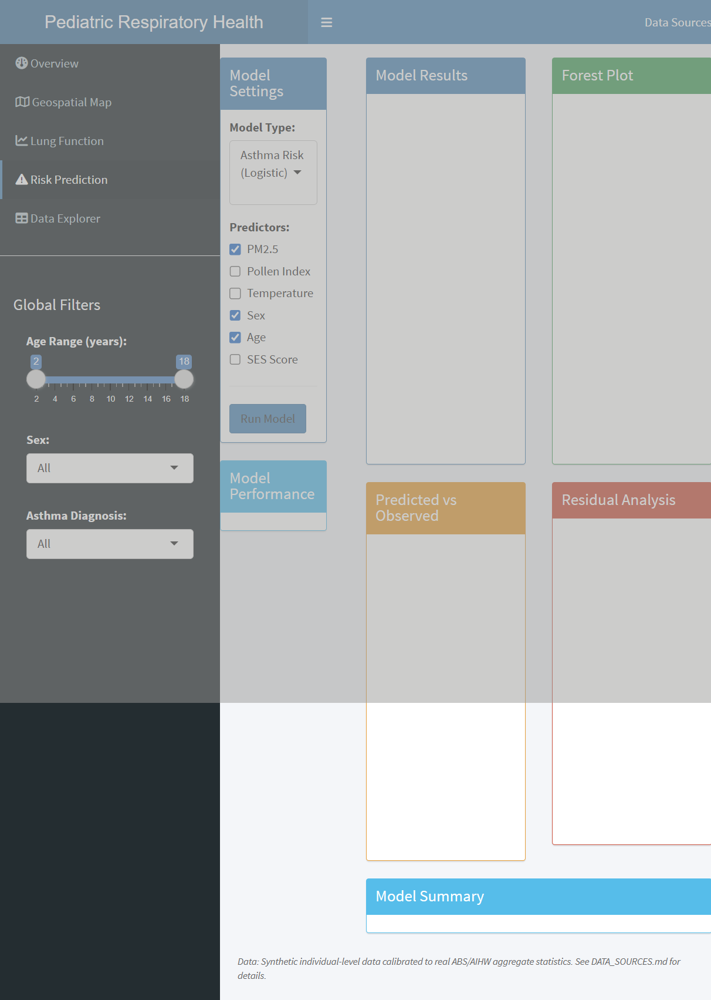

# Pediatric Respiratory Geospatial Dashboard

[](https://github.com/Classacre/respiratory-geospatial-dashboard/actions)

A comprehensive R Shiny dashboard for pediatric respiratory health analysis with geospatial components. This package provides tools for analyzing lung function trajectories, environmental risk factors, and spatial patterns of respiratory disease in pediatric populations.

## Overview

This dashboard was developed as a portfolio piece for a biostatistician role at The Kids Research Institute Australia. It demonstrates expertise in:

- **Geospatial Analysis**: Spatial autocorrelation, hotspot detection, and interpolation
- **Statistical Modeling**: Mixed-effects models, logistic regression, risk prediction
- **Interactive Visualization**: Leaflet maps, Plotly charts, and Shiny dashboards
- **R Package Development**: Proper package structure, documentation, and testing

## Features

### 1. Overview Dashboard
- Summary statistics and cohort description
- Demographic distributions (age, sex, SES)
- Environmental exposure summaries
- Lung function distributions

### 2. Geospatial Map
- Interactive Leaflet map of patient locations
- Heatmap layers for asthma prevalence and exacerbations
- Environmental overlay (air quality stations)
- Time slider for temporal analysis
- Spatial statistics and hotspot detection

### 3. Lung Function Trajectories
- Individual patient trajectory plots
- Population reference curves by age and sex
- Growth-adjusted percentiles
- Analysis by environmental risk factors

### 4. Risk Prediction
- Logistic regression for asthma risk
- Linear models for lung function
- Odds ratios visualization with forest plots
- Model performance metrics
- Predicted vs observed plots

### 5. Data Explorer
- Interactive data table with filtering
- Column selection and customization
- Download options (CSV, Excel, RDS)

## Installation

```r
# Install from GitHub
remotes::install_github("Classacre/respiratory-geospatial-dashboard")

# Or clone and install locally
git clone https://github.com/Classacre/respiratory-geospatial-dashboard.git
devtools::install("respiratory-geospatial-dashboard")
```

## Quick Start

```r
library(respiratorygeospatial)

# Launch the dashboard
run_dashboard()

# Access sample data
data(respiratory_data)
data(air_quality_stations)

# Generate new synthetic data
new_data <- generate_synthetic_data(n_patients = 1000)
```

## Data Structure

The package includes a synthetic dataset of 5,000 pediatric patients with:

| Variable | Description |
|----------|-------------|
| `patient_id` | Unique patient identifier |
| `sex` | Male/Female |
| `age_years` | Age in years (2-18) |
| `latitude` | Geographic latitude (Perth metro) |
| `longitude` | Geographic longitude (Perth metro) |
| `ses_score` | Socioeconomic status (0-100) |
| `pm25` | PM2.5 exposure (μg/m³) |
| `pollen_index` | Pollen index (0-10) |
| `fev1` | Forced Expiratory Volume (L) |
| `fvc` | Forced Vital Capacity (L) |
| `asthma_diagnosis` | Yes/No |
| `exacerbation_count` | Number of exacerbations |
| `visit_number` | Visit number (1-5) |

## Analysis Functions

### Spatial Analysis

```r
# Calculate spatial weights matrix
W <- calculate_spatial_weights(data, bandwidth = 10)

# Moran's I for spatial autocorrelation
moran_result <- calculate_morans_i(asthma_prevalence, W)

# Detect hotspots
hotspots <- detect_hotspots(data, outcome_col = "exacerbation_count")

# Spatial interpolation
grid <- create_interpolation_grid(bbox, resolution = 1)
pm25_surface <- idw_interpolate(data, "pm25", grid)
```

### Risk Modeling

```r
# Fit mixed-effects model for lung function
model <- fit_lung_function_model(
  data = respiratory_data,
  outcome = "fev1",
  fixed_effects = c("sex", "pm25", "ics_use"),
  random_effects = c("age_years")
)

# Logistic regression for asthma risk
asthma_model <- fit_asthma_risk_model(
  data,
  predictors = c("pm25", "pollen_index", "ses_score")
)

# Calculate odds ratios
or_table <- calculate_odds_ratios(asthma_model)
```

## Screenshots

*Dashboard Overview Tab*


*Geospatial Map with Patient Locations*


*Lung Function Trajectories*


*Risk Prediction Models*


## Project Structure

```
respiratory-geospatial-dashboard/
├── R/                          # Core analysis functions
│   ├── data_processing.R         # Synthetic data generation
│   ├── spatial_analysis.R        # Spatial statistics
│   ├── risk_modeling.R           # Statistical models
│   ├── geospatial_utils.R        # Mapping utilities
│   └── shiny_app.R               # App launcher
├── data/                       # Sample datasets
├── inst/shiny/                 # Shiny application
│   ├── app.R                     # Main app file
│   └── modules/                  # Shiny modules
├── tests/                      # Unit tests
├── vignettes/                  # Documentation
├── DESCRIPTION                 # Package metadata
└── README.md                   # This file
```

## Dependencies

### Core
- shiny, shinydashboard
- leaflet, leaflet.extras
- plotly, ggplot2
- DT

### Analysis
- sf, sp, spdep
- lme4
- gstat
- geosphere

### Data
- dplyr, tidyr
- lubridate

## Testing

```r
# Run all tests
devtools::test()

# Check package
devtools::check()
```

## Contributing

This is a portfolio project. For questions or suggestions, please open an issue on GitHub.

## License

MIT License - see LICENSE file for details.

## Author

Developed for The Kids Research Institute Australia biostatistician application.

## Acknowledgments

- Synthetic data generated for demonstration purposes
- Perth geographic boundaries used for spatial context
- Based on standard pediatric respiratory research methodologies
